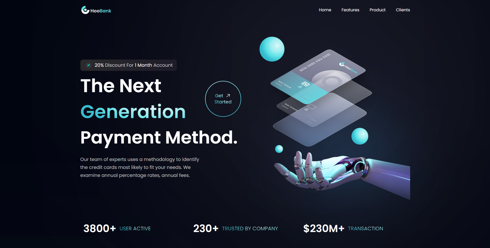
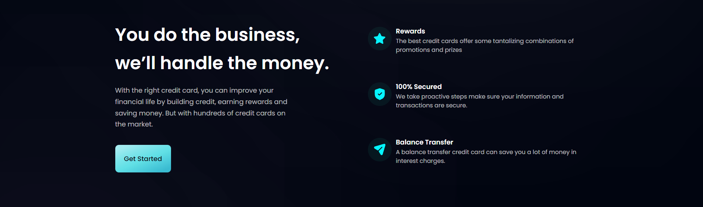
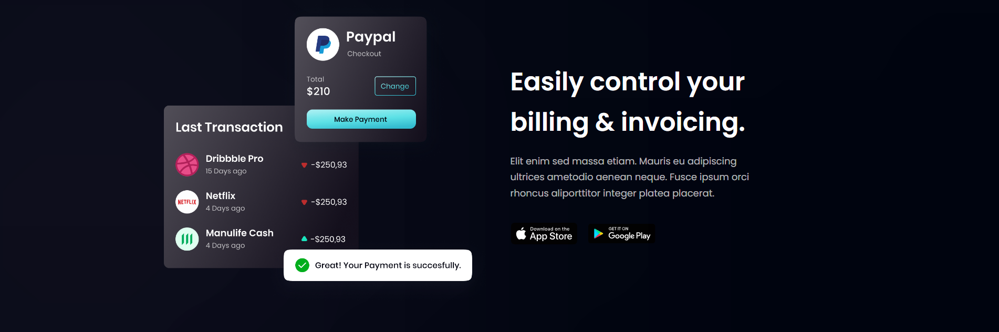
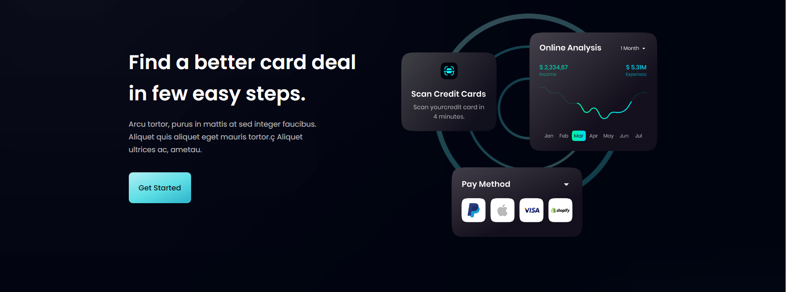
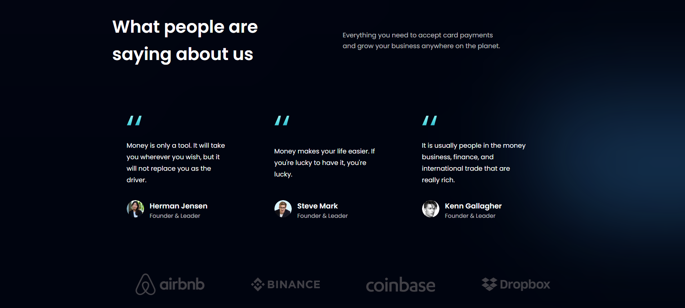
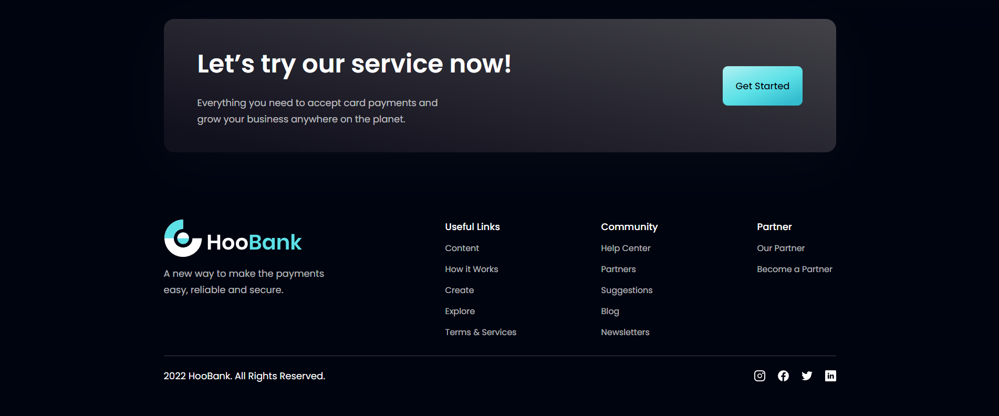

# Modern Landing Page Visualization

This is my first modern design implementation of a website. This was a proof of concept
that uses assets from Figma and inspiration from Dribble. Feel free to take a look around!

## Deployment

Live at the: [Home Page](https://polite-wisp-a0b2ed.netlify.app/)
## Tech Stack

**Client:** React JS, TailwindCSS, Vite

## Screenshots

